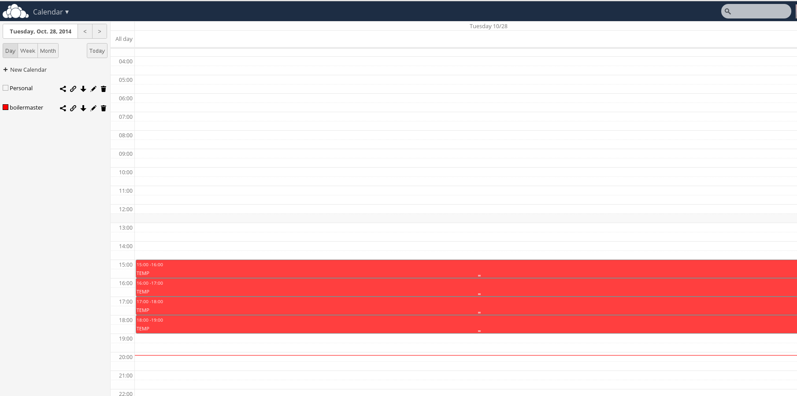
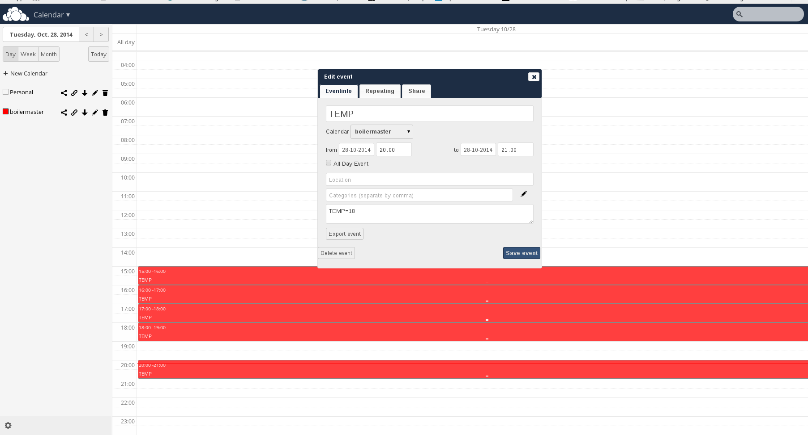
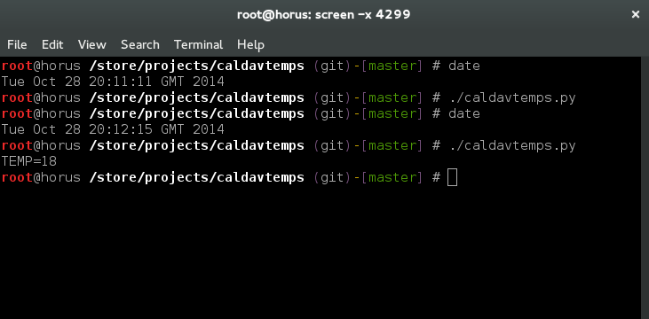

CALDAV-temps
============
Python script to retrieve temperatures from a CALDAV based calendar.

The script looks for entries with the title TEMP

The calendar entry must then have a temperature value in the form of TEMP=18 in the description

Screenshots
===========

Calendar showing no temperature listing for 20:00 - 21:00

Calendar now showing a temperature entry for 20:00 - 21:00

Terminal showing dates and running the script with results before and after adding the entry to the calendar.

